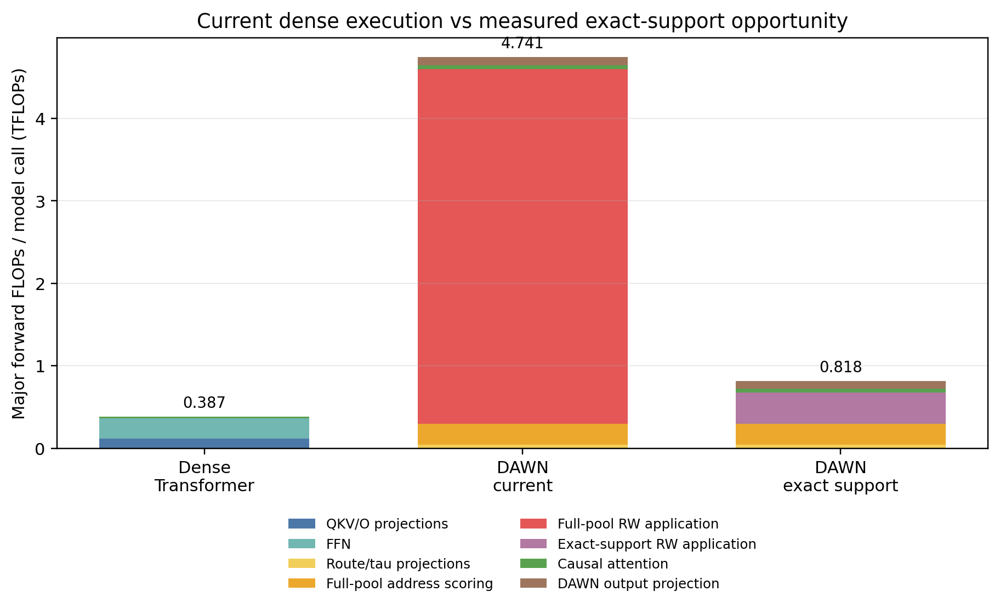

# DAWN-SRW v4172 400M compute-support assets

This directory is the immutable paper-asset snapshot from the completed
packed-C4 support profile at checkpoint step `76293`.

- Analysis commit: `d229a246215a777e27a545ef6066422134a64b2c`
- Checkpoint identity:
  `a7ce8afcd0242bc4e9b567c9e5066c36ca223461eaa6ae6f251e6525d1f91c17`
- Checkpoint-config hash:
  `08733ae4fefdfcda2bb8e61e51a6e6fce40c0b0e4d84cb80d715085da645039b`
- Support-summary hash:
  `b1eac5f53de9dabe61b1e0487b0fa9974e9930a833843c8b00447842c471bdc2`
- FLOP-accounting hash:
  `d7ad61152f358e8a450cee29ec48108135698d63b87c21ca2faec07ade5d984e`
- Evaluated positions: `9,994,240` packed-C4 token positions
- GCS source:
  `gs://dawn-tpu-data-c4/checkpoints/dawn_srw_v4172_400M_c4_40B_v4_64_ver1_den_qk0p5_v1p0_rst1p2/run_vspatial-r1-v4.1.7.2_20260715_133004_3201/side_analysis/run_analysis_000000076293_paper_compute_support_20260730T085517Z-333b900e`

## Headline result

At exact `selection_margin > 0`, aggregate mean active support is:

| Route | Mean active | Pool fraction |
|---|---:|---:|
| Q | 487.896 | 10.606% |
| K | 386.722 | 8.407% |
| Q/K union | 812.388 | 17.661% |
| V | 1,649.994 | 11.379% |
| RST | 2,017.703 | 6.886% |

The static forward accounting for batch 1 and sequence length 512 is
`4.741260116` TFLOPs for current dense DAWN execution, `0.818230250` TFLOPs
for the measured exact-support execution opportunity, and `0.386547057`
TFLOPs for the matched dense Transformer. The exact-support estimate is
`17.2577%` of current DAWN accounting, but remains `2.1168x` the dense
Transformer accounting.

This is a structural/functional sparsity result. Current DAWN kernels still
score and apply full operator pools. The exact-support column is a
mathematically exact execution opportunity, not an implemented sparse kernel,
and these assets contain no production latency, energy, or hardware-efficiency
claim.

## Files

- `support_summary.json`, `support_aggregate.csv`, and
  `support_by_layer.csv`: aggregate exact/epsilon support statistics.
- `flop_accounting.json`, `flop_components.csv`, and
  `computational_characteristics.csv`: reproducible FLOP accounting and
  paper-table rows.
- `flops_stacked.png` and `flops_stacked.pdf`: raster and vector figure
  exports.
- `run_manifest.json`, `summary.log`, and `flop_accounting.log`: run identity
  and compact audit summaries.
- `SHA256SUMS.txt`: byte-level hashes for the generated source artifacts.

Do not edit generated assets manually. Regenerate them with the pinned analysis
commit and compare both semantic result hashes and `SHA256SUMS.txt`.
